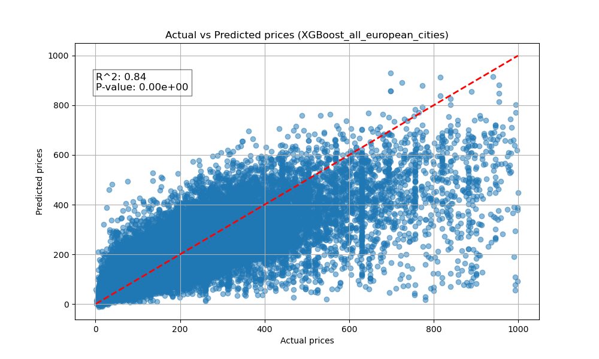
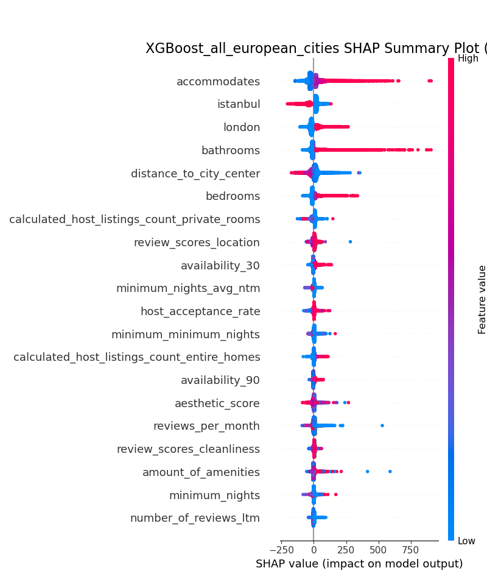
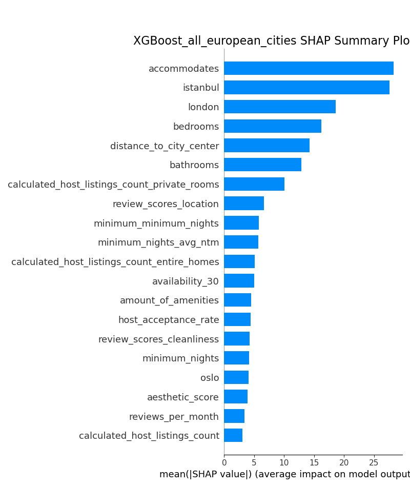
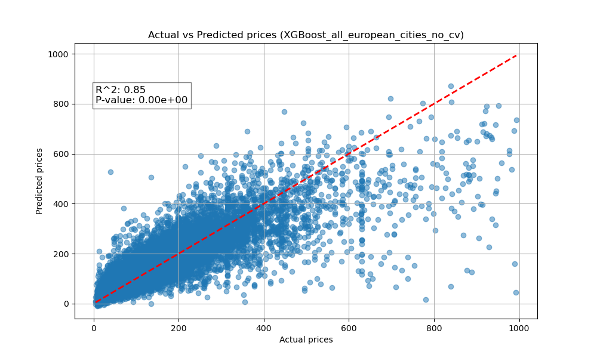
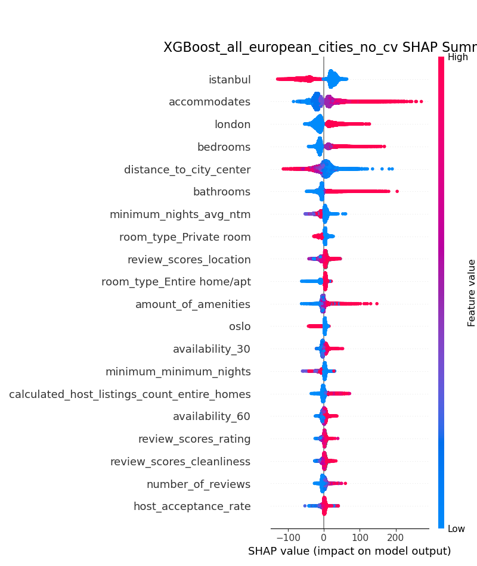
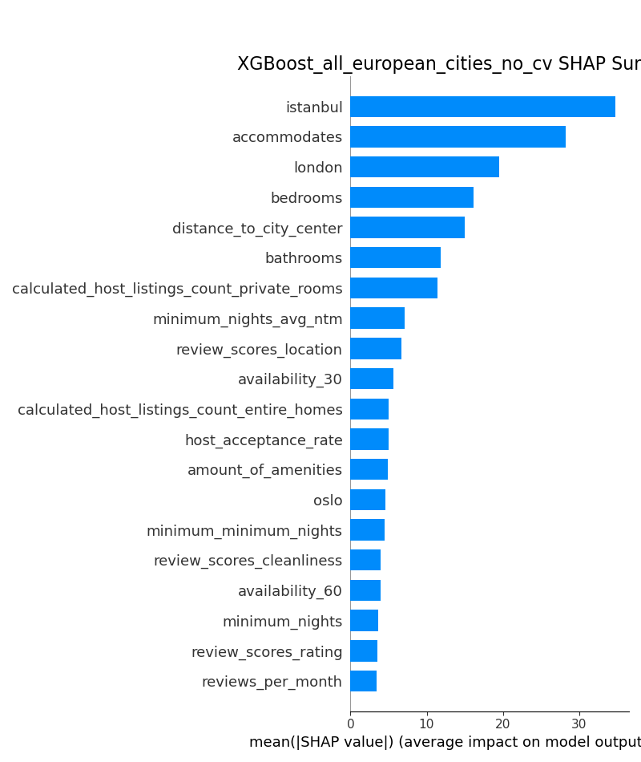

Results
=======

XGBoost Regressor Xgboost_all_european_cities
---------------------------------------------

The parameters of the model:

.. literalinclude:: ../results/XGBoost_all_european_cities/XGBoost_all_european_cities_pipeline.log
   :caption: Log
   :lines: 1-15

   The actual vs predicted values of the model. With the Pearson correlation coefficient and p-value.

   The SHAP values of the model. The effects of the individual features can be read from this plot.

   The absolute SHAP values of the model. The feature importances can be read from this plot.

XGBoost Regressor Xgboost_all_european_cities_no_cv
---------------------------------------------------

The parameters of the model:

.. literalinclude:: ../results/XGBoost_all_european_cities_no_cv/XGBoost_all_european_cities_no_cv_pipeline.log
   :caption: Log
   :lines: 1-15

   The actual vs predicted values of the model. With the Pearson correlation coefficient and p-value.

   The SHAP values of the model. The effects of the individual features can be read from this plot.

   The absolute SHAP values of the model. The feature importances can be read from this plot.

