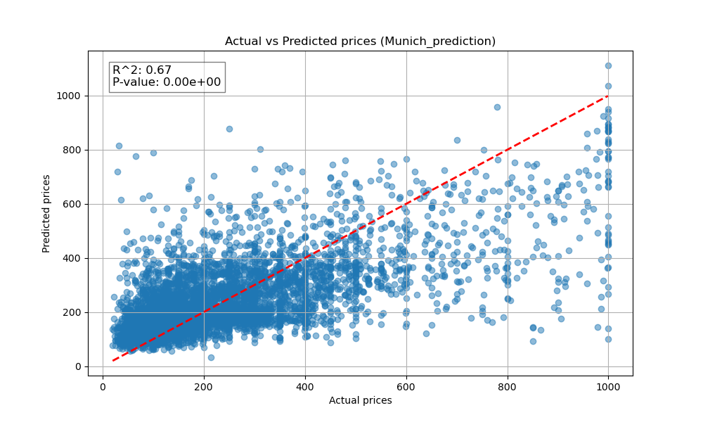
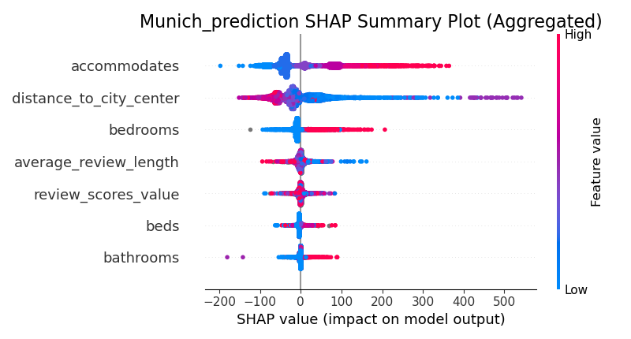
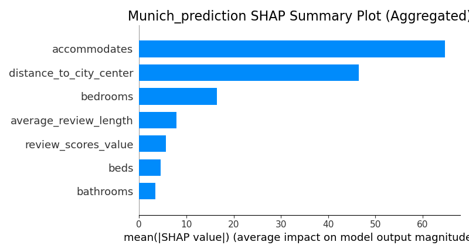
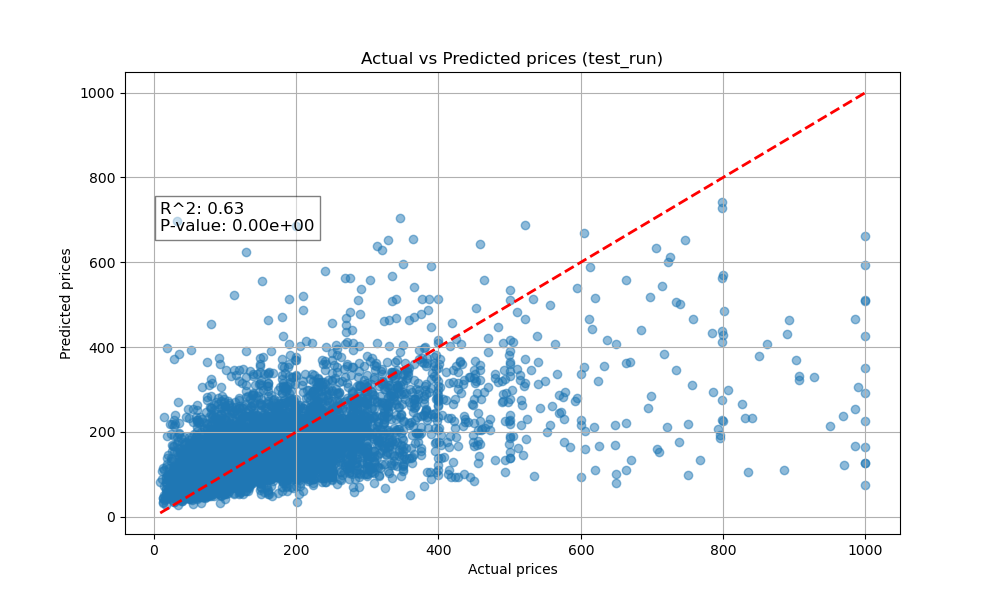
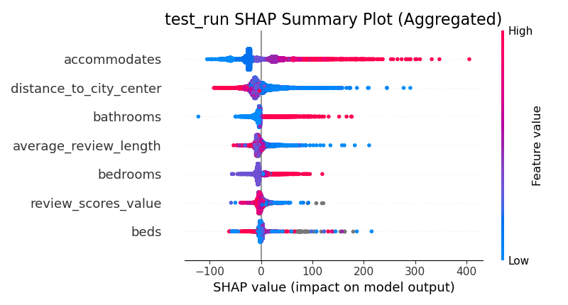
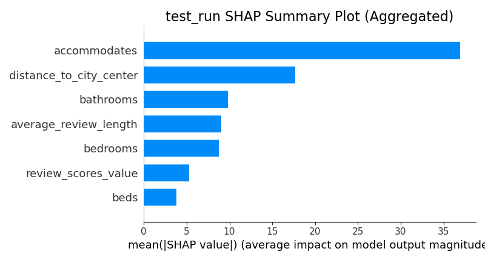

Results
=======

XGBoost Regressor Munich_prediction
-----------------------------------

The parameters of the model:

.. literalinclude:: ../results/Munich_prediction/Munich_prediction_pipeline.log
   :caption: Log
   :lines: 1-15

   The actual vs predicted values of the model. With the Pearson correlation coefficient and p-value.

   The SHAP values of the model. The effects of the individual features can be read from this plot.

   The absolute SHAP values of the model. The feature importances can be read from this plot.

XGBoost Regressor Test_run
--------------------------

The parameters of the model:

.. literalinclude:: ../results/test_run/test_run_pipeline.log
   :caption: Log
   :lines: 1-15

   The actual vs predicted values of the model. With the Pearson correlation coefficient and p-value.

   The SHAP values of the model. The effects of the individual features can be read from this plot.

   The absolute SHAP values of the model. The feature importances can be read from this plot.

