Results
=======

XGBoost Regressor Berlin_linear
-------------------------------

XGBoost Regressor Berlin_randomforest
-------------------------------------

XGBoost Regressor Berlin_tabpfn
-------------------------------

XGBoost Regressor Berlin_prediction_xgboost
-------------------------------------------

The parameters of the model:

.. literalinclude:: ../results/Berlin_prediction_XGBoost/Berlin_prediction_XGBoost_pipeline.log
   :caption: Log
   :lines: 1-15

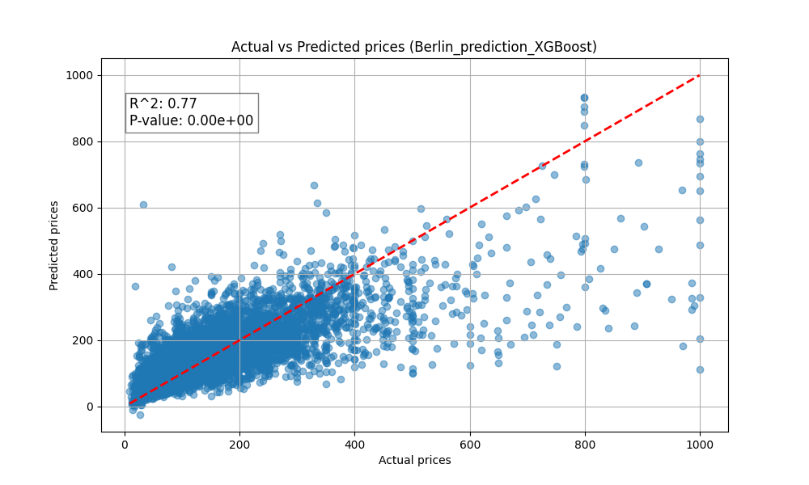

   The actual vs predicted values of the model. With the Pearson correlation coefficient and p-value.

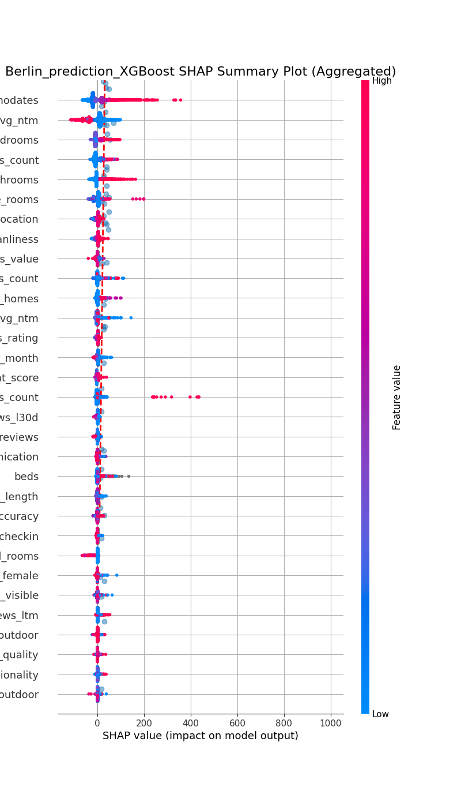

   The SHAP values of the model. The effects of the individual features can be read from this plot.

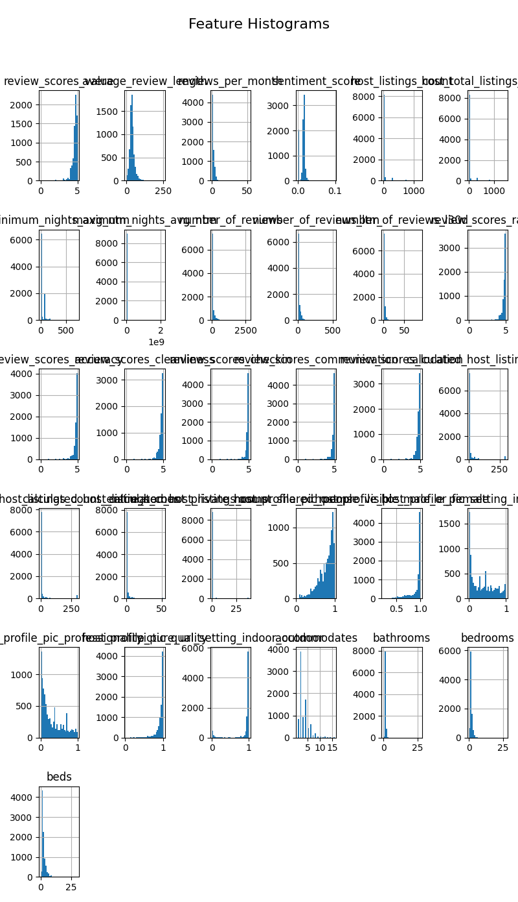

   The absolute SHAP values of the model. The feature importances can be read from this plot.

XGBoost Regressor Berlin_with_custom_features_xgboost
-----------------------------------------------------

The parameters of the model:

.. literalinclude:: ../results/Berlin_with_custom_features_XGBoost/Berlin_with_custom_features_XGBoost_pipeline.log
   :caption: Log
   :lines: 1-15

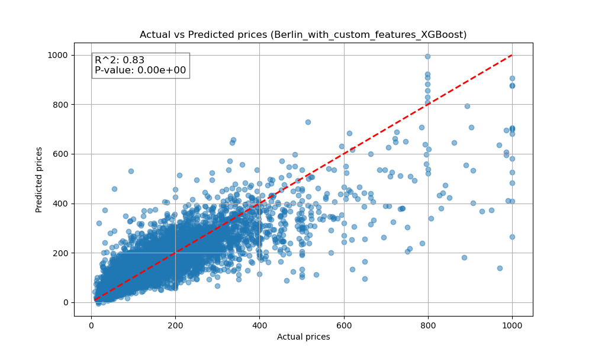

   The actual vs predicted values of the model. With the Pearson correlation coefficient and p-value.

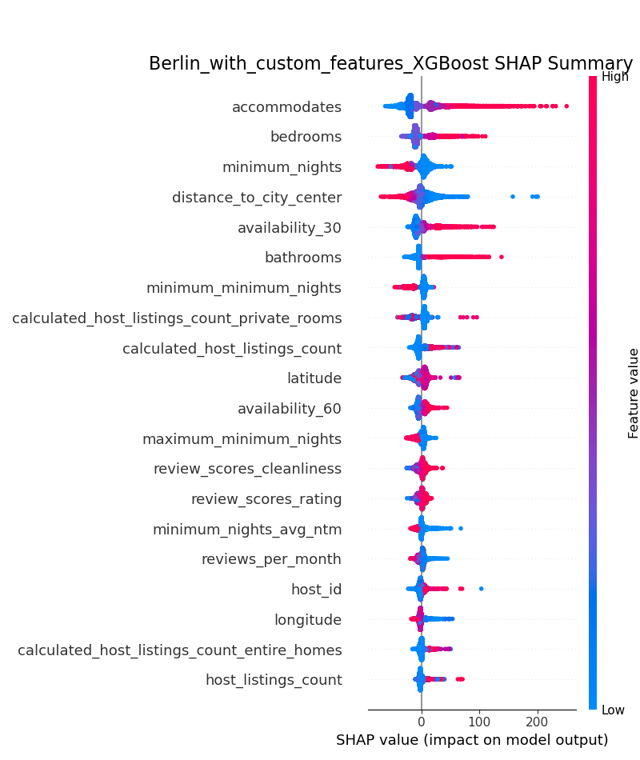

   The SHAP values of the model. The effects of the individual features can be read from this plot.

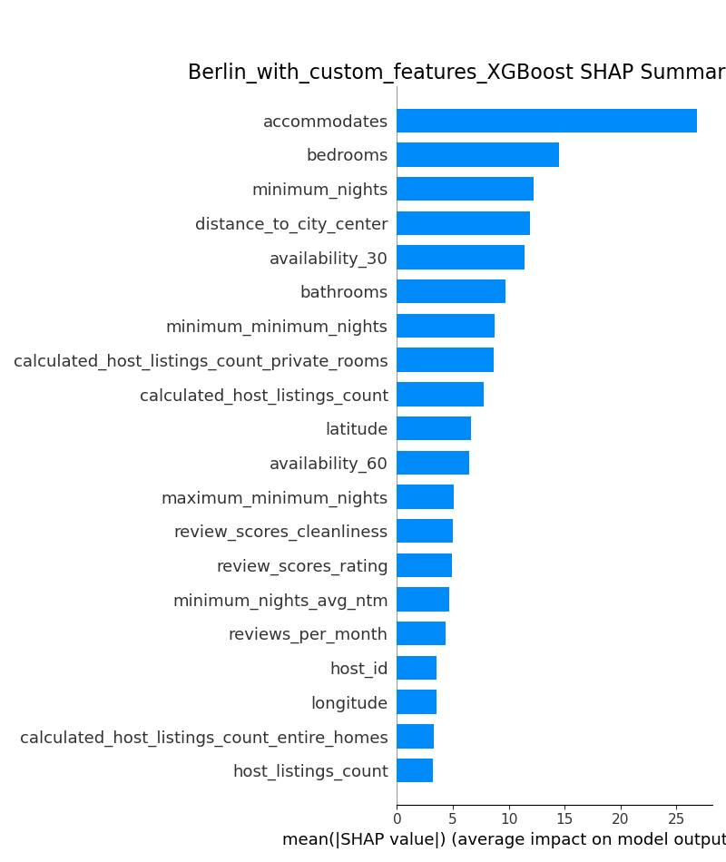

   The absolute SHAP values of the model. The feature importances can be read from this plot.

XGBoost Regressor Linearregression
----------------------------------

XGBoost Regressor Munich_prediction
-----------------------------------

The parameters of the model:

.. literalinclude:: ../results/Munich_prediction/Munich_prediction_pipeline.log
   :caption: Log
   :lines: 1-15

.. figure:: ../results/Munich_prediction/Munich_prediction_actual_vs_predicted.png
   :alt: Actual Vs Predicted

   The actual vs predicted values of the model. With the Pearson correlation coefficient and p-value.

.. figure:: ../results/Munich_prediction/Munich_prediction_shap_aggregated_beeswarm.png
   :alt: Shap Aggregated Beeswarm

   The SHAP values of the model. The effects of the individual features can be read from this plot.

.. figure:: ../results/Munich_prediction/Munich_prediction_shap_aggregated_bar.png
   :alt: Shap Aggregated Bar

   The absolute SHAP values of the model. The feature importances can be read from this plot.

XGBoost Regressor Tokyo_prediction
----------------------------------

The parameters of the model:

.. literalinclude:: ../results/Tokyo_prediction/Tokyo_prediction_pipeline.log
   :caption: Log
   :lines: 1-15

XGBoost Regressor Xgboost_all_european_cities
---------------------------------------------

The parameters of the model:

.. literalinclude:: ../results/XGBoost_all_european_cities/XGBoost_all_european_cities_pipeline.log
   :caption: Log
   :lines: 1-15

.. figure:: ../results/XGBoost_all_european_cities/XGBoost_all_european_cities_actual_vs_predicted.png
   :alt: Actual Vs Predicted

   The actual vs predicted values of the model. With the Pearson correlation coefficient and p-value.

.. figure:: ../results/XGBoost_all_european_cities/XGBoost_all_european_cities_shap_aggregated_beeswarm.png
   :alt: Shap Aggregated Beeswarm

   The SHAP values of the model. The effects of the individual features can be read from this plot.

.. figure:: ../results/XGBoost_all_european_cities/XGBoost_all_european_cities_shap_aggregated_bar.png
   :alt: Shap Aggregated Bar

   The absolute SHAP values of the model. The feature importances can be read from this plot.

XGBoost Regressor Zurich_prediction
-----------------------------------

The parameters of the model:

.. literalinclude:: ../results/Zurich_prediction/Zurich_prediction_pipeline.log
   :caption: Log
   :lines: 1-15

XGBoost Regressor Test_ft_transformer
-------------------------------------

XGBoost Regressor Test_linearregression
---------------------------------------

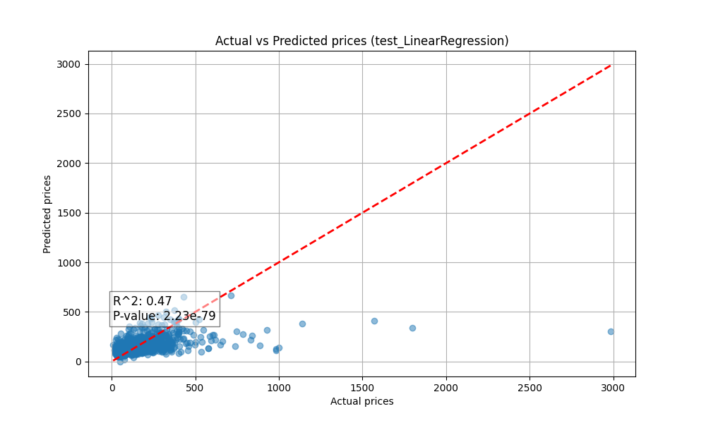

   The actual vs predicted values of the model. With the Pearson correlation coefficient and p-value.

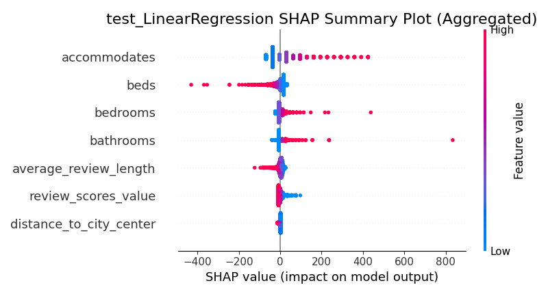

   The SHAP values of the model. The effects of the individual features can be read from this plot.

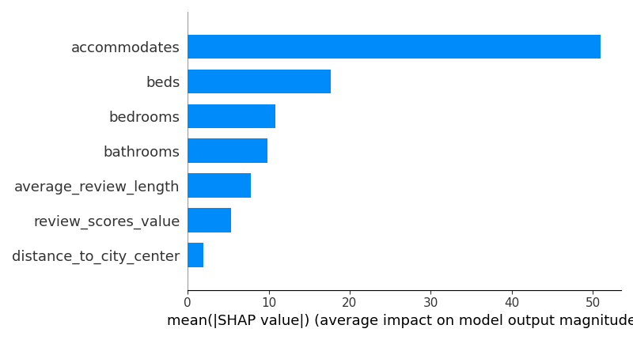

   The absolute SHAP values of the model. The feature importances can be read from this plot.

XGBoost Regressor Test_randomforest
-----------------------------------

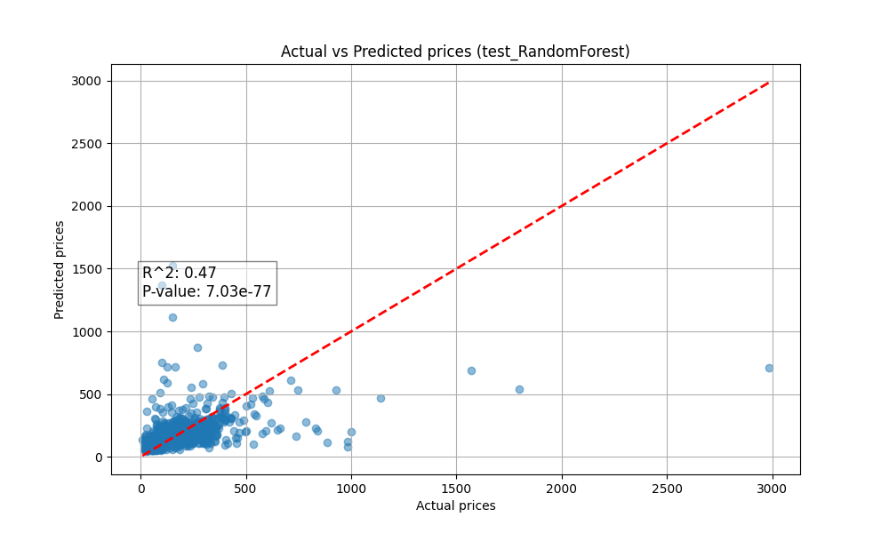

   The actual vs predicted values of the model. With the Pearson correlation coefficient and p-value.

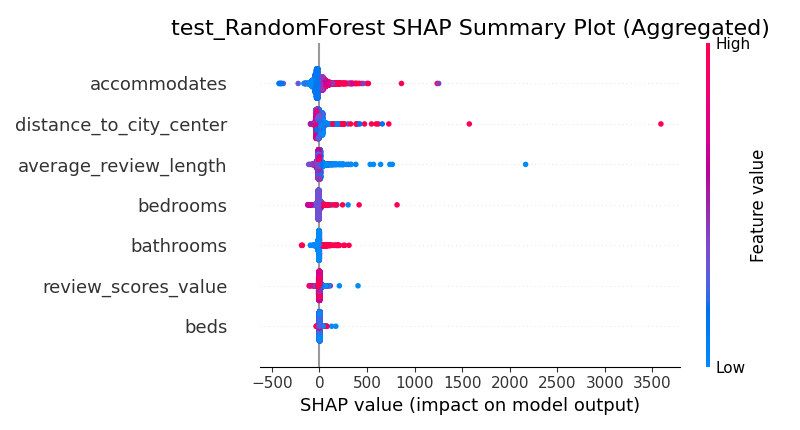

   The SHAP values of the model. The effects of the individual features can be read from this plot.

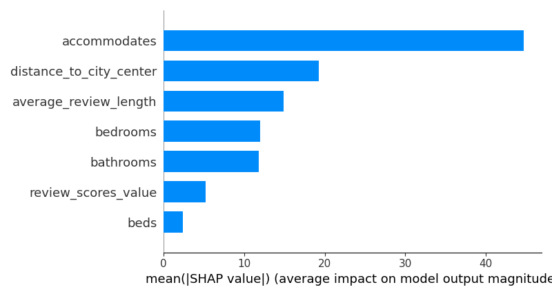

   The absolute SHAP values of the model. The feature importances can be read from this plot.

XGBoost Regressor Test_run
--------------------------

The parameters of the model:

.. literalinclude:: ../results/test_run/test_run_pipeline.log
   :caption: Log
   :lines: 1-15

.. figure:: ../results/test_run/test_run_actual_vs_predicted.png
   :alt: Actual Vs Predicted

   The actual vs predicted values of the model. With the Pearson correlation coefficient and p-value.

.. figure:: ../results/test_run/test_run_shap_aggregated_beeswarm.png
   :alt: Shap Aggregated Beeswarm

   The SHAP values of the model. The effects of the individual features can be read from this plot.

.. figure:: ../results/test_run/test_run_shap_aggregated_bar.png
   :alt: Shap Aggregated Bar

   The absolute SHAP values of the model. The feature importances can be read from this plot.

